# 校园二手交易平台

> Campus Second-hand Trading Platform — 面向高校学生的 C2C 闲置物品交易与资源共享平台

## 项目简介

本项目是一个前后端分离的校园二手交易平台，覆盖**商品交易、求购匹配、免费赠送、信用评价、资讯公告**等核心业务场景，并提供完善的后台管理系统。采用 Spring Boot + Vue 3 主流技术栈，功能完整、结构清晰。

平台专为高校师生设计，提供安全、便捷、可信的二手交易环境，支持信用体系建设、实名认证、举报处理等机制，保障交易双方权益。

---

## 系统架构

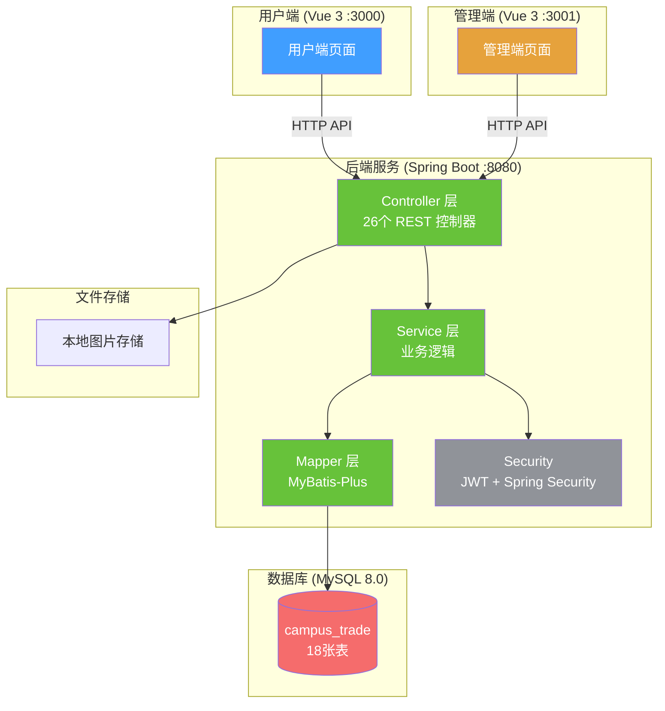

## 技术栈

| 层级 | 技术 | 版本要求 |
|------|------|----------|
| 后端框架 | Spring Boot | 2.7.14 / Java 17 |
| ORM | MyBatis-Plus | 3.5.3.1 |
| 数据库 | MySQL | 8.0.29+ |
| 安全认证 | Spring Security + JWT (jjwt) | — |
| 用户端 | Vue 3 + Element Plus + Pinia + Vite | Node.js 16+ |
| 管理端 | Vue 3 + Element Plus + ECharts + Sass + Vite | Node.js 16+ |
| 构建工具 | Maven | 3.6+ |

---

## 项目结构

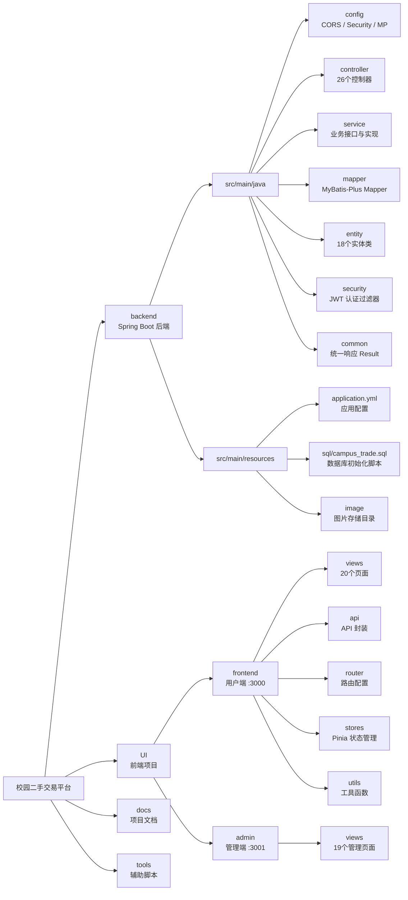

### 完整目录树

```
校园二手交易平台/
├── backend/                                    # 后端服务 (Spring Boot)
│   ├── src/main/java/com/campus/trade/
│   │   ├── CampusTradeApplication.java         # 启动类
│   │   ├── config/                             # 配置类
│   │   │   ├── CorsConfig.java                 #   CORS跨域配置
│   │   │   ├── SecurityConfig.java             #   Spring Security安全配置
│   │   │   └── MyBatisPlusConfig.java          #   MyBatis-Plus分页/逻辑删除配置
│   │   ├── controller/                         # REST 控制器
│   │   │   ├── AuthController.java             #   认证（注册/登录）
│   │   │   ├── ProductController.java          #   商品 CRUD
│   │   │   ├── OrderController.java            #   订单管理
│   │   │   ├── CommentController.java          #   评论管理
│   │   │   ├── CategoryController.java         #   分类管理
│   │   │   ├── WantController.java             #   求购
│   │   │   ├── WantOfferController.java        #   求购出价
│   │   │   ├── FreeController.java             #   免费赠送
│   │   │   ├── NewsController.java             #   资讯
│   │   │   ├── NewsCategoryController.java     #   资讯分类
│   │   │   ├── CreditController.java           #   信用
│   │   │   ├── AnnouncementController.java     #   公告
│   │   │   ├── BannerController.java           #   轮播图
│   │   │   ├── NotificationController.java     #   通知
│   │   │   ├── UserController.java             #   用户信息
│   │   │   ├── ReportController.java           #   举报
│   │   │   ├── CustomerServiceController.java  #   客服咨询
│   │   │   ├── FileController.java             #   文件上传
│   │   │   ├── StatisticsController.java       #   统计
│   │   │   ├── OperationLogController.java     #   操作日志
│   │   │   └── admin/                          #   管理端专用控制器
│   │   │       ├── AdminAnnouncementController.java
│   │   │       ├── AdminBannerController.java
│   │   │       ├── AdminCreditController.java
│   │   │       ├── AdminFreeController.java
│   │   │       ├── AdminReportController.java
│   │   │       └── AdminWantOfferController.java
│   │   ├── service/                            # 业务接口与实现
│   │   │   ├── impl/
│   │   │   │   ├── ProductServiceImpl.java
│   │   │   │   ├── OrderServiceImpl.java
│   │   │   │   └── ...
│   │   │   ├── ProductService.java
│   │   │   ├── OrderService.java
│   │   │   └── ...
│   │   ├── mapper/                             # MyBatis-Plus Mapper
│   │   │   ├── ProductMapper.java
│   │   │   ├── OrderMapper.java
│   │   │   └── ...
│   │   ├── entity/                             # 实体类（18个）
│   │   │   ├── Product.java
│   │   │   ├── Order.java
│   │   │   ├── User.java
│   │   │   └── ...
│   │   ├── security/                           # JWT 认证
│   │   │   ├── JwtAuthenticationFilter.java
│   │   │   ├── JwtTokenProvider.java
│   │   │   └── CustomUserDetailsService.java
│   │   └── common/                             # 通用工具
│   │       └── Result.java                     #   统一响应封装
│   └── src/main/resources/
│       ├── application.yml                     # 应用配置
│       ├── sql/campus_trade.sql                # 数据库初始化脚本
│       └── image/                              # 图片存储目录
│
├── UI/
│   ├── frontend/                               # 用户端 (Vue 3)
│   │   ├── src/
│   │   │   ├── views/                          # 页面组件（20个）
│   │   │   │   ├── Home.vue                    #   首页
│   │   │   │   ├── Products.vue                #   商品浏览
│   │   │   │   ├── ProductDetail.vue           #   商品详情
│   │   │   │   ├── Publish.vue                 #   发布商品
│   │   │   │   ├── Wants.vue                   #   求购广场
│   │   │   │   ├── PublishWant.vue             #   发布求购
│   │   │   │   ├── Free.vue                    #   免费赠送列表
│   │   │   │   ├── FreeDetail.vue              #   免费赠送详情
│   │   │   │   ├── PublishFree.vue             #   发布赠送
│   │   │   │   ├── Orders.vue                  #   我的订单
│   │   │   │   ├── Credit.vue                  #   信用中心
│   │   │   │   ├── News.vue                    #   校园资讯
│   │   │   │   ├── NewsDetail.vue              #   资讯详情
│   │   │   │   ├── Profile.vue                 #   个人中心（10个tab）
│   │   │   │   ├── Login.vue                   #   登录
│   │   │   │   ├── Register.vue                #   注册
│   │   │   │   ├── Help.vue                    #   帮助中心
│   │   │   │   ├── About.vue                   #   关于我们
│   │   │   │   ├── CreditTest.vue              #   信用测试
│   │   │   │   └── CreditDebug.vue             #   信用调试
│   │   │   ├── api/                            # API 封装
│   │   │   ├── router/                         # 路由配置
│   │   │   ├── stores/                         # Pinia 状态管理
│   │   │   └── utils/                          # 工具函数
│   │   └── ...
│   │
│   └── admin/                                  # 管理端 (Vue 3)
│       └── src/views/                          # 管理页面（18个）
│           ├── Dashboard.vue                   #   数据仪表盘
│           ├── DataCharts.vue                  #   数据图表（ECharts）
│           ├── Users.vue                       #   用户管理
│           ├── Products.vue                    #   商品管理
│           ├── Orders.vue                      #   订单管理
│           ├── Categories.vue                  #   分类管理
│           ├── Comments.vue                    #   评论管理
│           ├── Wants.vue                       #   求购管理
│           ├── WantOffers.vue                  #   出价管理
│           ├── Free.vue                        #   免费赠送管理
│           ├── News.vue                        #   资讯管理
│           ├── NewsCategories.vue              #   资讯分类管理
│           ├── Credits.vue                     #   信用管理
│           ├── Reports.vue                     #   举报管理
│           ├── Banners.vue                     #   轮播图管理
│           ├── Announcements.vue               #   公告管理
│           ├── CustomerService.vue             #   客服咨询管理
│           └── Logs.vue                        #   操作日志
│
├── docs/                                       # 项目文档
│   └── 项目总结报告.md
│
└── tools/                                      # 辅助脚本
    ├── add_contributor_comments.ps1
    └── add_contributor_comments.py
```

---

## 功能模块

### 🛍️ 用户端功能

#### 1. 首页 — 平台入口与概览

**页面**: `Home.vue`
**API**: 轮播图、公告、分类、商品列表、统计数据

首页采用三栏布局，是平台的信息聚合入口：

- **左侧** — 垂直分类导航栏（9 个分类，如电子产品、图书教材、生活用品等，带图标，点击跳转至商品列表并自动筛选）
- **中部** — 轮播横幅（动态获取后端 Banner，无数据时展示默认主题轮播）+ 搜索栏（关键词搜索 + 热门搜索标签快速检索）+ 商品展示区（最新发布商品，5 列网格布局，支持分类 tab 筛选和分页）
- **右侧** — 用户面板（登录后显示信用分、认证状态、发布按钮；未登录显示注册/登录入口）+ 平台公告栏（最多 5 条，支持 "HOT"/"NEW" 标签）
- **全局** — 右下角悬浮客服按钮，快捷联系平台客服

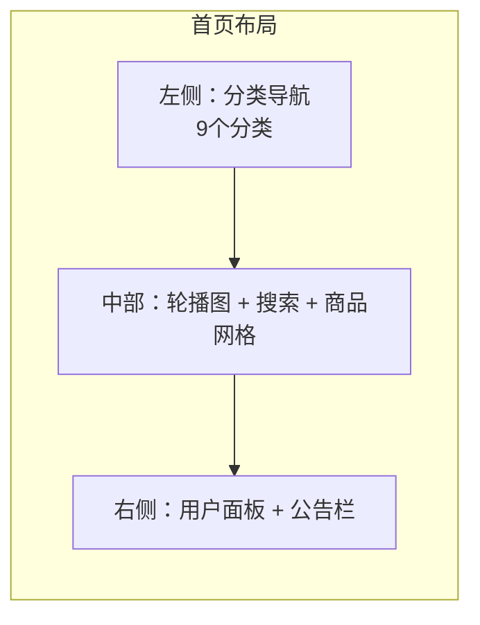

#### 2. 商品浏览 — 闲置市场

**页面**: `Products.vue`
**API**: `GET /products`（分页、筛选、排序）

功能完善的商品浏览页面，左侧筛选区 + 右侧商品网格：

- **分类筛选** — 从后端获取全部分类列表，点击切换
- **价格筛选** — 最低价/最高价输入框，精确筛选
- **成色筛选** — 全新 / 几乎全新 / 良好 / 可接受
- **排序方式** — 综合排序 / 最新发布 / 价格升序 / 价格降序
- **商品卡片** — 展示缩略图、标题、价格、卖家头像昵称、所在地
- **状态处理** — 加载骨架屏、空状态提示、分页器
- **URL 传参** — 支持 `?categoryId=` 直接跳转到指定分类

#### 3. 商品详情 — 商品信息与交易入口

**页面**: `ProductDetail.vue`
**API**: `GET /products/{id}`、`POST /orders`

单个商品的完整详情页：

- **图片区** — 主图预览（支持大图弹窗）+ 缩略图切换（悬停切换）
- **信息区** — 标题、浏览量/发布时间元信息、价格展示（现价 + 原价划线）、信息标签（成色、位置、库存、分类）
- **卖家卡片** — 头像、昵称、实名认证标记、信用等级和分数（颜色区分）
- **购买操作** — 数量选择器 + 立即购买按钮 + 收藏按钮
- **底部 tab** — 商品详情（描述、成色说明、额外图片）和留言提问（楼层式评论回复，支持分页）
- **推荐商品** — 同分类其他商品推荐（最多 4 个）
- **举报入口** — 弹出举报对话框（选择原因 + 描述）

#### 4. 发布商品 — 商品上架

**页面**: `Publish.vue`
**API**: `POST /products`、`PUT /products/{id}`

支持新增和编辑两种模式（通过 `?id=` 参数区分），左右双栏表单布局：

- **左侧** — 商品标题、详细描述（多行文本框）、图片上传（最多 5 张，含预览与删除）
- **右侧** — 分类下拉选择、价格输入、原价输入、成色单选（四档）、库存数量、交易位置
- **校验** — 标题/分类/价格/描述/位置为必填项
- **提交流程** — 自动处理图片数组，成功后跳转至个人中心的"我的发布"

#### 5. 求购广场 — 发布与响应求购需求

**页面**: `Wants.vue`、`PublishWant.vue`
**API**: `GET /wants`、`POST /wants`、`POST /want-offers`

求购专区，连接有购买需求的买家与潜在卖家：

- **浏览** — 卡片列表展示求购信息（发布者头像、标题、标签、预算范围），支持按关键词搜索和按预算排序
- **出价** — 点击"我以此价出"弹出出价对话框，填写出价金额、商品描述、联系方式、交易地点，系统校验出价是否在预算范围内
- **发布求购** — 表单填写标题、描述（10-500 字）、预算范围（最低/最高价）、自定义标签（最多 5 个）

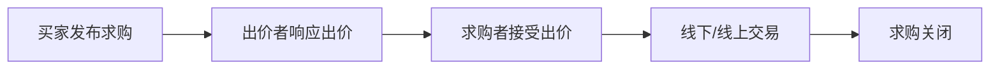

#### 6. 免费赠送 — 闲置物品免费流转

**页面**: `Free.vue`、`FreeDetail.vue`、`PublishFree.vue`
**API**: `GET /free`、`POST /free`、`PUT /free/{id}`

绿色主题的免费赠送模块，促进物品循环利用：

- **浏览** — 4 列网格展示，每张卡片带"免费送"角标、显示 "¥0.00" + "仅需付邮"标签
- **详情** — 双栏布局展示商品信息，显示"完全免费，自取或邮费自付"提示
- **发布** — 表单填写标题、图片（最多 6 张）、描述、成色、交接地点
- **管理** — 发布者可编辑信息、标记已送出、重新上架

#### 7. 订单管理 — 交易全流程跟踪

**页面**: `Orders.vue`（精简版）、`Profile.vue`（完整版）
**API**: `GET /orders/buyer`、`GET /orders/seller`、`PUT /orders/{id}/pay` 等

买家与卖家双视角的订单管理，覆盖交易全生命周期：

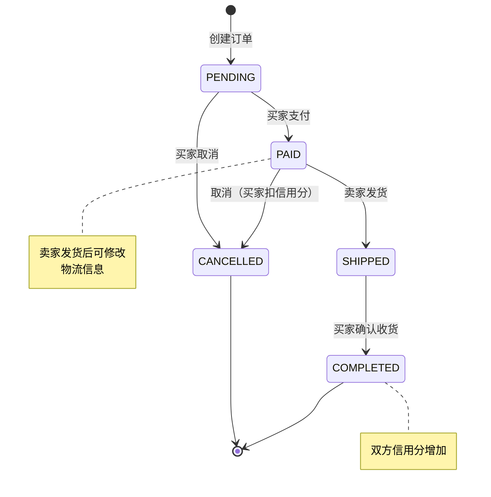

订单号格式：`ORD` + 时间戳 + 4 位随机数，保证唯一性。

#### 8. 信用中心 — 用户信用体系

**页面**: `Credit.vue`
**API**: `GET /credit/my`、`POST /credit/daily-checkin`、`GET /credit/rules`

完善的信用评价体系，提升平台交易信任度：

- **信用概览** — 圆形大数字展示信用分 + 等级名称（优秀/良好/一般/较差）+ 等级图标
- **每日签到** — 每日签到奖励 +2 分，连续签到培养用户粘性
- **信用权益** — 4 个权益卡片展示不同等级的专属权益（极速发布、优先展示、担保交易、专属徽章）
- **信用规则** — 从后端动态获取，清晰展示加分/扣分行为及分值
- **信用记录** — 表格展示每条变更记录（原因、变化 +/—、变化前后数值、时间）

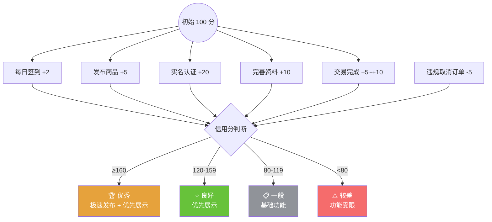

#### 9. 校园资讯 — 平台动态与信息发布

**页面**: `News.vue`、`NewsDetail.vue`
**API**: `GET /news`、`GET /news/{id}`

资讯内容展示模块：

- **列表页** — 水平分类筛选胶囊 + 双栏布局（左侧资讯列表 + 右侧热门排行）
- **详情页** — 完整文章展示，含分类标签、作者、日期、阅读量、封面图
- **热门排行** — 按浏览量排序的前 5 条资讯

#### 10. 个人中心 — 用户自治后台

**页面**: `Profile.vue`
**API**: 多端点（用户信息、商品、订单、通知、咨询等）

功能最丰富的页面，包含 10 个功能 tab：

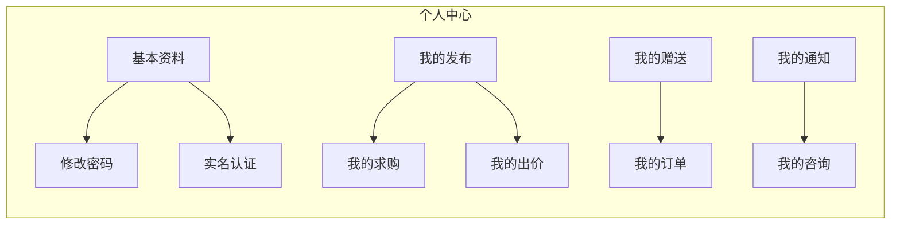

| Tab | 功能 |
|-----|------|
| 基本资料 | 查看/编辑头像、昵称、手机号、邮箱 |
| 修改密码 | 原密码验证 + 新密码设置 |
| 实名认证 | 学号认证（10 位数字，以 2 开头），首次认证 +20 分 |
| 我的发布 | 商品上架/下架/编辑/删除 |
| 我的求购 | 求购编辑/关闭/重新开启/删除 |
| 我的出价 | 出价记录查看与删除 |
| 我的赠送 | 赠送编辑/标记送出/重新上架/删除 |
| 我的订单 | 买家/卖家双视角切换，全流程操作 |
| 我的通知 | 通知列表（未读标记）、标记已读/全部已读/删除 |
| 我的咨询 | 客服咨询记录、查看回复、追问 |

#### 11. 用户认证 — 注册与登录

**页面**: `Login.vue`、`Register.vue`
**API**: `POST /auth/login`、`POST /auth/register`

- **注册** — 头像上传、用户名、昵称、手机号（11 位校验）、校园邮箱（格式校验）、密码（6 位以上）、确认密码一致性
- **登录** — 用户名 + 密码，支持"记住我"、密码显隐切换、回车提交
- **安全** — 密码 BCrypt 加密，JWT Token 鉴权（24 小时有效期）

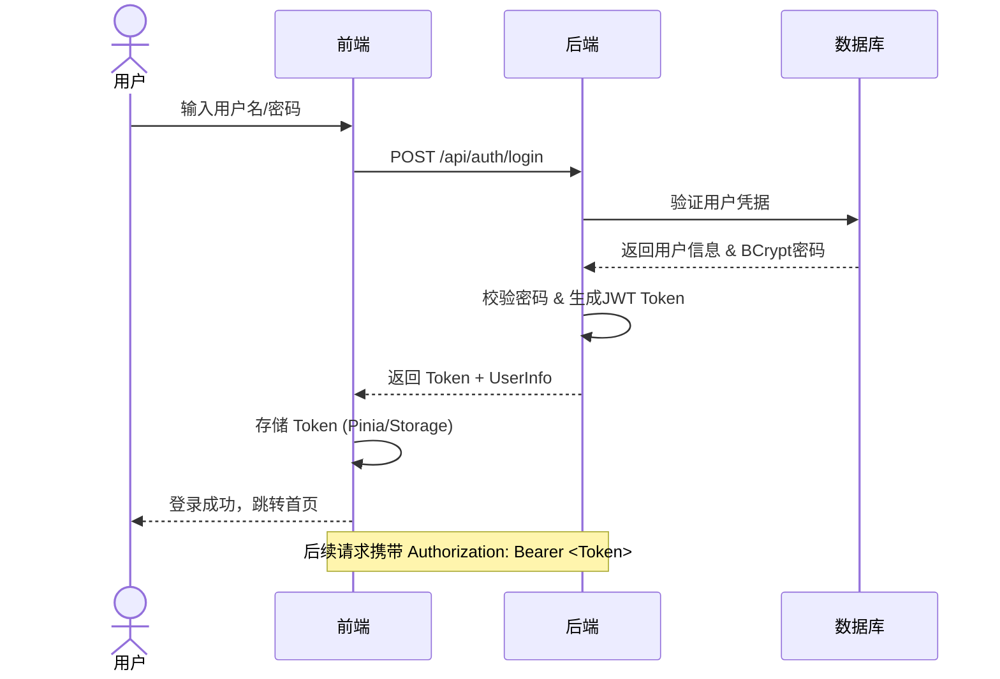

#### 12. 客服与帮助

**页面**: `CustomerService.vue`（管理端）、`Help.vue`、`About.vue`

- **客服咨询** — 用户提交咨询（匿名或登录均可），客服回复后可追问
- **帮助中心** — 买家指南、卖家指南、交易规则、常见问题（FAQ 折叠面板）
- **关于我们** — 平台介绍、联系方式（电话、邮箱、地址）

---

### 🔧 管理端功能

管理员后台（需 ADMIN 角色登录），共 18 个管理视图，采用一致的搜索-表格-弹窗操作模式。

#### 1. 数据仪表盘 — 运营概览

**页面**: `Dashboard.vue`
**API**: `GET /statistics/overview`、`GET /statistics/dashboard`

- **核心指标** — 总用户数、在售商品数、已完成订单数、交易总额
- **待处理任务** — 待发货数量、运输中订单、低库存商品
- **最近订单** — 最近 10 条订单的金额/状态/时间
- **热门商品** — 按浏览量排序的前 10 件商品
- **快捷操作** — 点击卡片跳转到用户/商品/订单/举报管理
- **自动刷新** — 每 30 秒轮询更新数据

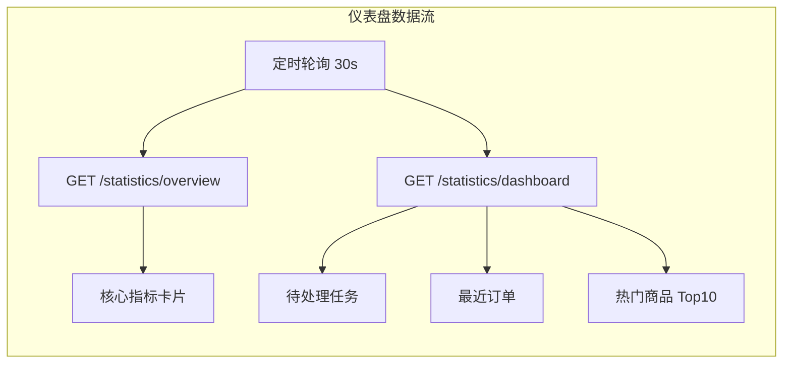

#### 2. 数据图表 — 可视化统计

**页面**: `DataCharts.vue`
**API**: `GET /statistics/charts/*`

基于 ECharts 的运营数据分析：

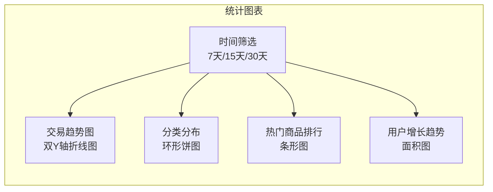

#### 3. 用户管理 — 账户管控

**页面**: `Users.vue`
**API**: `GET /users`、`POST /users`、`PUT /users/{id}` 等

- **列表** — 分页查询，支持关键词（用户名/邮箱/手机号）、角色、状态搜索
- **新增** — 用户名/密码/昵称/邮箱/手机号/角色/头像
- **编辑** — 修改昵称、邮箱、手机号、头像
- **启用/禁用** — 切换用户状态（status 1/0）
- **删除** — 含确认弹窗
- **校验** — 用户名 3-20 字符（字母/数字/下划线），密码 6-20 字符

#### 4. 商品管理 — 商品审核与上下架

**页面**: `Products.vue`
**API**: `GET /products`、`POST /products`、`PUT /products/{id}/status` 等

- **列表** — 支持按名称、分类、状态（ON_SALE / SOLD / OFF_SALE）搜索
- **新增/编辑** — 完整商品信息表单，含图片上传（最多 5 张，2MB 限制）
- **上架/下架** — 状态切换（SOLD 商品不可修改）
- **删除** — 含确认弹窗

#### 5. 订单管理 — 交易监控

**页面**: `Orders.vue`
**API**: `GET /orders`、`PUT /orders/{id}`、`PUT /orders/{id}/ship` 等

- **列表** — 按订单号、状态搜索，展示完整订单信息
- **详情** — 订单号、金额、买卖双方、地址、各状态时间戳
- **操作** — 发货、完成、取消（仅 PENDING 可取消）
- **编辑** — 修改数量、地址、联系电话、备注
- **删除** — 仅 COMPLETED 或 CANCELLED 状态可删除

#### 6. 分类管理 — 商品分类维护

**页面**: `Categories.vue`
**API**: `GET /categories/all`、`POST /categories` 等

- **列表** — 全量分类，支持名称搜索
- **新增/编辑** — 名称、描述、排序值（越小越靠前）、状态
- **启用/禁用** — 状态切换
- **删除** — 含确认弹窗

#### 7. 评论管理 — 用户评价审核

**页面**: `Comments.vue`
**API**: `GET /comments/admin/all`、`DELETE /comments/admin/{id}`

- **列表** — 分页查询，按内容关键词搜索，显示用户和关联商品
- **删除** — 管理员强制删除违规评论

#### 8. 求购管理 — 求购信息维护

**页面**: `Wants.vue`
**API**: `GET /wants`、`DELETE /wants/{id}`

- **列表** — 按名称搜索、按状态（ACTIVE/CLOSED）筛选
- **详情** — 查看完整求购信息
- **删除** — 管理员删除

#### 9. 出价管理 — 求购出价维护

**页面**: `WantOffers.vue`
**API**: `GET /admin/want-offers`、`DELETE /admin/want-offers/{id}`

- **列表** — 按出价状态（PENDING/ACCEPTED/REJECTED）筛选
- **详情** — 查看完整出价详情
- **删除** — 管理员删除出价记录

#### 10. 免费物品管理 — 赠送内容审核

**页面**: `Free.vue`（管理端）
**API**: `GET /admin/free`、`DELETE /admin/free/{id}`

- **列表** — 按关键词、状态（AVAILABLE/COMPLETED/CLOSED）筛选
- **详情** — 查看完整信息（含多图预览）
- **删除** — 管理员删除

#### 11. 资讯管理 — 内容发布

**页面**: `News.vue`（管理端）
**API**: `GET /news`、`POST /news`、`PUT /news/{id}` 等

- **列表** — 展示封面图、标题、分类、作者、浏览量、状态
- **新增/编辑** — 标题、分类、封面图（建议 800x450）、正文内容、状态（发布/草稿）
- **删除** — 含确认弹窗

#### 12. 资讯分类管理 — 栏目维护

**页面**: `NewsCategories.vue`
**API**: `GET /news-categories`、`POST /news-categories` 等

- **列表** — 全量分类，支持名称搜索
- **新增/编辑** — 名称、描述、排序值、状态；名称校验 2-20 字符
- **启用/禁用** — 单独状态切换 API
- **删除** — 含确认弹窗

#### 13. 信用管理 — 用户信用调控

**页面**: `Credits.vue`
**API**: `GET /admin/credits`、`POST /admin/credits/{userId}/add` 等

- **列表** — 用户信用分展示（带等级彩色徽章），支持按关键词、等级筛选
- **信用记录** — 查看指定用户的完整信用变更明细
- **调整信用分** — 管理员手动增加/扣除，需选择类型、填写分值和原因
- **重置实名认证** — 允许用户重新认证获取 +20 分
- **重置信用分** — 重置为初始值 100，清除统计数据

#### 14. 举报管理 — 违规处理

**页面**: `Reports.vue`
**API**: `GET /admin/reports`、`POST /admin/reports/{id}/accept` 等

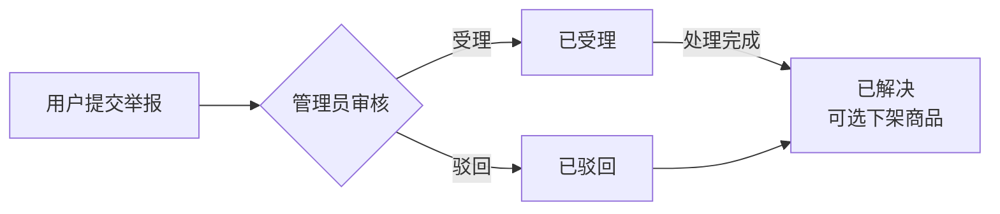

- **通知联动** — 受理/驳回/解决均通过 Notification 通知相关用户

#### 15. 轮播图管理 — 首页运营配置

**页面**: `Banners.vue`
**API**: `GET /admin/banners`、`POST /admin/banners` 等

- **列表** — 图片预览、标题、跳转链接、排序、状态、有效期
- **新增/编辑** — 标题、副标题、图片 URL、跳转链接、排序、状态、有效期起止
- **启用/停用** — 状态切换
- **排序调整** — 独立修改排序值

#### 16. 公告管理 — 平台通知配置

**页面**: `Announcements.vue`
**API**: `GET /admin/announcements`、`POST /admin/announcements` 等

- **列表** — 按状态和类型（HOT/NEW/NORMAL）筛选，显示彩色类型标签
- **新增/编辑** — 标题、内容（最多 1000 字）、类型、优先级、跳转链接、状态、有效期
- **启用/停用** — 状态切换
- **删除** — 含确认弹窗

#### 17. 客服咨询管理 — 用户咨询处理

**页面**: `CustomerService.vue`
**API**: `GET /customer-service/admin/list`、`PUT /customer-service/admin/{id}/reply` 等

- **统计卡片** — 待处理 / 处理中 / 已回复 / 已关闭 数量统计
- **列表** — 按状态、类型（GENERAL/COMPLAINT/SUGGESTION/TECHNICAL）、关键词搜索
- **回复** — 管理员填写回复内容，自动记录回复人和时间
- **状态管理** — 标记处理中 / 关闭咨询
- **删除** — 含确认弹窗

#### 18. 操作日志 — 管理员行为审计

**页面**: `Logs.vue`
**API**: `GET /logs`、`DELETE /logs/batch`、`DELETE /logs/clean` 等

- **列表** — 按操作类型（CREATE/UPDATE/DELETE/QUERY/LOGIN）、模块、管理员、关键词搜索
- **详情** — 完整日志信息（含 IP、浏览器、操作系统）
- **清理** — 清理 7 天前 / 30 天前日志，或清空所有日志（含二次确认）

---

## 数据库设计

数据库 `campus_trade`，字符集 `utf8mb4`，共 18 张表：

### 实体关系图

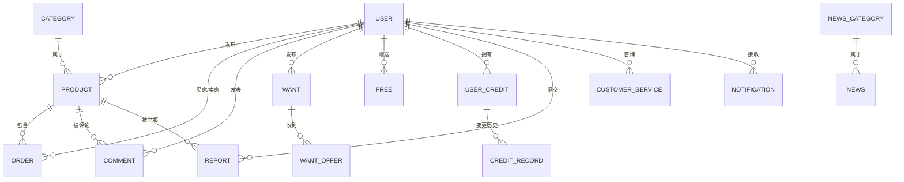

### 完整表清单

| 表名 | 说明 | 关联模块 | 核心字段 |
|------|------|----------|---------|
| `user` | 用户表 | 认证、用户管理 | 角色(USER/SELLER/ADMIN)、状态、头像、实名认证 |
| `category` | 商品分类 | 分类管理 | 名称、排序值、启用状态 |
| `product` | 商品表 | 商品模块 | 成色、库存、浏览量、上下架状态、逻辑删除 |
| `order` | 订单表 | 订单模块 | 状态机(PENDING→PAID→SHIPPED→COMPLETED/CANCELLED)、金额、各状态时间 |
| `comment` | 评论表 | 评论模块 | 楼层式回复（parent_id）、关联用户与商品 |
| `want` | 求购表 | 求购模块 | 预算范围(min/max)、自定义标签、状态(ACTIVE/CLOSED) |
| `want_offer` | 求购出价表 | 出价模块 | 金额、描述、联系方式、状态(PENDING/ACCEPTED/REJECTED) |
| `free` | 免费赠送表 | 赠送模块 | 成色、交接地点、状态(AVAILABLE/COMPLETED/CLOSED) |
| `news` | 资讯表 | 资讯模块 | 分类、封面图、浏览量、发布状态(PUBLISHED/DRAFT) |
| `news_category` | 资讯分类 | 资讯分类管理 | 名称、排序值、启用状态 |
| `banner` | 轮播图表 | 轮播图管理 | 标题、链接、图片URL、排序、有效期 |
| `announcement` | 公告表 | 公告管理 | 类型(HOT/NEW/NORMAL)、优先级、有效期 |
| `notification` | 通知表 | 通知系统 | 类型、内容、已读状态、关联业务ID |
| `user_credit` | 用户信用表 | 信用体系 | 积分值、等级、总获得/总扣除统计、最后签到时间 |
| `credit_record` | 信用变更记录 | 信用记录 | 类型(TRADE/EVALUATE/TASK/BEHAVIOR/VIOLATION/ADMIN)、分值变化、原因 |
| `report` | 举报表 | 举报管理 | 原因、状态(PENDING/ACCEPTED/REJECTED/RESOLVED)、处理人和结果 |
| `customer_service` | 客服咨询表 | 客服模块 | 类型(GENERAL/COMPLAINT/SUGGESTION/TECHNICAL)、状态、回复内容 |
| `operation_log` | 操作日志表 | 审计日志 | 操作类型(CREATE/UPDATE/DELETE/QUERY/LOGIN)、模块、IP、浏览器 |

---

## 后端 API 概览

| 路径 | 模块 | 说明 |
|------|------|------|
| `/api/auth/**` | 认证 | 注册、登录、获取用户信息 |
| `/api/products/**` | 商品 | 商品 CRUD、搜索、筛选、排序、状态切换 |
| `/api/orders/**` | 订单 | 订单创建、支付、发货、完成、取消 |
| `/api/comments/**` | 评论 | 商品评论与回复、管理员审核 |
| `/api/categories/**` | 分类 | 分类查询（用户端/管理端） |
| `/api/wants/**` | 求购 | 求购发布、查询、关闭、重新开启 |
| `/api/want-offers/**` | 求购出价 | 出价、接受、拒绝 |
| `/api/free/**` | 免费赠送 | 赠送发布、查询、状态管理 |
| `/api/news/**` | 资讯 | 资讯列表、详情、管理 |
| `/api/news-categories/**` | 资讯分类 | 分类查询（用户端/管理端） |
| `/api/credit/**` | 信用 | 信用查询、签到、规则、记录 |
| `/api/files/**` | 文件上传 | 图片上传（UUID 命名，按日期归档） |
| `/api/banners/**` | 轮播图 | 活跃轮播图查询 |
| `/api/announcements/**` | 公告 | 活跃公告查询 |
| `/api/reports/**` | 举报 | 用户提交举报 |
| `/api/customer-service/**` | 客服 | 咨询提交、回复、管理 |
| `/api/notifications/**` | 通知 | 用户通知查询、标记已读 |
| `/api/users/**` | 用户 | 信息修改、密码、实名认证、管理 |
| `/api/statistics/**` | 统计 | 首页统计、仪表盘、ECharts 图表数据 |
| `/api/logs/**` | 操作日志 | 日志查询、清理、审计 |
| `/api/admin/**` | 管理端 | 公告、轮播图、信用、赠送、举报、出价管理 |

---

## 快速启动

### 环境要求

| 软件 | 版本要求 | 下载地址 |
|------|----------|----------|
| JDK | 8+ 推荐 17 | [Oracle 官网](https://www.oracle.com/java/technologies/downloads/) |
| MySQL | 8.0.29+ | [MySQL 官网](https://dev.mysql.com/downloads/mysql/) |
| Node.js | 16.x+ | [Node.js 官网](https://nodejs.org/) |
| Maven | 3.6+（可选，可使用 IDE 内置） | [Maven 官网](https://maven.apache.org/download.cgi) |

### 启动流程

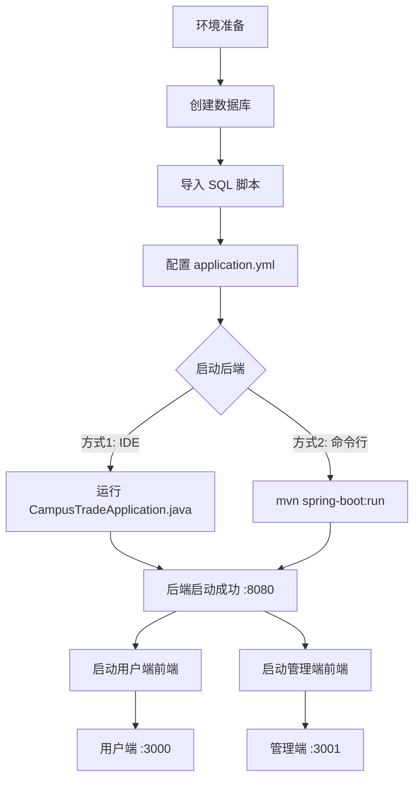

### 第一步：数据库配置

```bash
# 1. 创建数据库
mysql -u root -p -e "CREATE DATABASE campus_trade CHARACTER SET utf8mb4 COLLATE utf8mb4_unicode_ci;"

# 2. 导入初始化数据
mysql -u root -p campus_trade < backend/src/main/resources/sql/campus_trade.sql
```

### 第二步：修改数据库连接

编辑 `backend/src/main/resources/application.yml`，设置数据库用户名和密码：

```yaml
spring:
  datasource:
    url: jdbc:mysql://localhost:3306/campus_trade?useUnicode=true&characterEncoding=utf8&useSSL=false&serverTimezone=Asia/Shanghai&allowPublicKeyRetrieval=true
    username: root
    password: 你的密码
```

### 第三步：启动后端服务

**方式一：使用 IDE 启动（推荐）**

1. 使用 IntelliJ IDEA 或 Eclipse 打开项目
2. 导入 Maven 项目：`backend` 目录
3. 等待依赖下载完成
4. 找到启动类：`CampusTradeApplication.java`
5. 右键运行或点击绿色运行按钮

**方式二：命令行启动**

```bash
cd backend
mvn clean install
mvn spring-boot:run
```

或者打包后运行：

```bash
mvn clean package
cd target
java -jar second-hand-trade-1.0.0.jar
```

**启动成功标志**：

```
Tomcat started on port(s): 8080 (http) with context path '/api'
Started CampusTradeApplication in X.XXX seconds
```

### 第四步：启动用户端

```bash
cd UI/frontend
npm install     # 首次运行需要安装依赖
npm run dev
```

访问地址：http://localhost:3000

### 第五步：启动管理端

```bash
cd UI/admin
npm install     # 首次运行需要安装依赖
npm run dev
```

访问地址：http://localhost:3001

### 一键启动（Windows）

创建 `start-all.bat` 文件：

```batch
@echo off
title 校园二手交易平台启动器
color 0A
echo ============================================================
echo           校园二手交易平台 - 一键启动脚本
echo ============================================================

:: 启动后端服务
echo 正在启动后端服务...
start "后端服务" cmd /k "cd backend && mvn spring-boot:run"
timeout /t 10 /nobreak >nul

:: 启动用户端前端
echo 正在启动用户端前端...
start "用户端前端" cmd /k "cd UI\frontend && npm run dev"
timeout /t 5 /nobreak >nul

:: 启动管理端前端
echo 正在启动管理端前端...
start "管理端前端" cmd /k "cd UI\admin && npm run dev"

echo.
echo 启动完成！
echo 用户端访问地址：http://localhost:3000
echo 管理端访问地址：http://localhost:3001
echo 后端API地址：http://localhost:8080/api
echo.
pause
```

### 一键停止（Windows）

创建 `stop-all.bat` 文件：

```batch
@echo off
echo 正在停止所有服务...
taskkill /f /im java.exe
taskkill /f /im node.exe
echo 服务已停止
pause
```

### 访问地址

| 服务 | 地址 | 端口 |
|------|------|------|
| 后端 API | http://localhost:8080/api | 8080 |
| 用户端 | http://localhost:3000 | 3000 |
| 管理端 | http://localhost:3001 | 3001 |

### 测试账号

| 角色 | 用户名 | 密码 |
|------|--------|------|
| 管理员 | admin | 123456 |
| 普通用户 | user1 | 123456 |
| 卖家 | seller1 | 123456 |

---

## 常见问题解决

### 1. 端口被占用

```cmd
netstat -ano | findstr :8080
taskkill /PID [进程ID] /F
```

### 2. 数据库连接失败

- 检查 MySQL 服务是否启动
- 验证数据库用户名密码是否正确
- 确认数据库 `campus_trade` 是否存在
- 检查防火墙设置

### 3. 前端依赖安装失败

```cmd
npm cache clean --force
rd /s /q node_modules
npm install

:: 或切换镜像源
npm config set registry https://registry.npmmirror.com
```

### 4. 后端启动内存不足

```cmd
set JAVA_OPTS="-Xms512m -Xmx1024m"
```

---

## 安全设计

- **密码安全** — BCrypt 加密存储
- **Token 鉴权** — JWT Token（24 小时有效期），请求头 `Authorization: Bearer <token>`
- **角色权限** — 基于角色的访问控制（USER / SELLER / ADMIN），管理端 `@PreAuthorize` 双重校验
- **文件安全** — 文件上传大小限制（10MB），UUID 重命名防冲突
- **数据保护** — MyBatis-Plus 逻辑删除保障数据可追溯
- **操作审计** — 管理员操作日志审计（操作类型、模块、IP、终端信息）

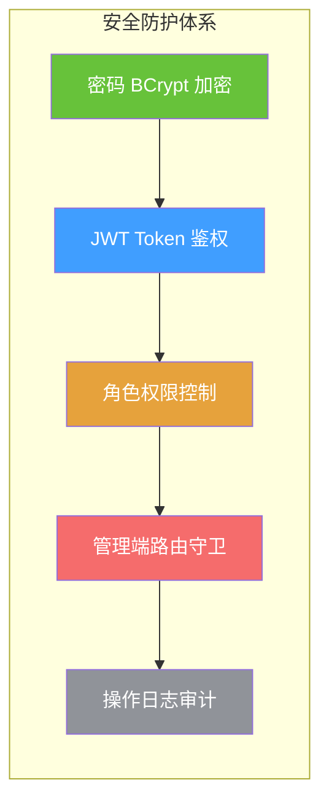

## 特色设计

### 信用体系

平台内置完善的信用激励体系，贯穿用户全生命周期的各个行为节点：

| 行为 | 分值 | 说明 |
|------|------|------|
| 每日首次登录 | +2 | 自动触发 |
| 每日签到 | +2 | 手动签到 |
| 发布商品 | +5 | 每件商品 |
| 商品获得首次评价（卖家） | +10 | 仅首次 |
| 交易完成（买家） | +5 | 确认收货后 |
| 交易完成（卖家） | +10 | 确认收货后 |
| 实名认证 | +20 | 首次完成 |
| 完善个人信息 | +10 | 信息完整度达标 |
| 已支付订单取消（买家） | -5 | 违规扣分 |

**等级划分**：

| 等级 | 信用分范围 | 权益 |
|------|-----------|------|
| 🏆 优秀 | ≥160 | 极速发布 + 优先展示 + 担保交易 + 专属徽章 |
| ⭐ 良好 | 120–159 | 优先展示 |
| 📋 一般 | 80–119 | 基础功能 |
| ⚠️ 较差 | <80 | 功能受限 |

### 通知系统

平台内置统一的通知机制，覆盖以下场景：

- 举报受理/驳回/解决通知（举报人和被举报人）
- 订单状态变更通知
- 客服回复通知
- 信用分变动提示
- 支持单条标记已读 / 全部标记已读

---

## 项目亮点

- **功能完整** — 覆盖商品交易、求购匹配、免费赠送、信用评价、校园资讯、客服咨询、举报处理等校园二手全场景
- **双端分离** — 用户端与管理端独立部署，职责清晰，各自独立迭代
- **信用体系** — 积分任务、每日签到、实名认证奖励等多维度激励，提升交易信任度
- **数据可视化** — 管理端 ECharts 图表多维分析（交易趋势、分类分布、用户增长），支持运营决策
- **安全可控** — 完整的权限控制、操作审计、举报处理机制、BCrypt 加密、JWT 鉴权
- **可扩展架构** — 标准 Controller → Service → Mapper 分层设计，18 张表覆盖完整业务，易于扩展和维护

## 团队

本项目为开源与群智课程综合实践项目。

## 许可证

MIT
