# 校园二手交易平台 — 项目总结报告

> **项目名称**：Campus Second-hand Trading Platform（91026 校园二手交易平台）  
> **文档版本**：v2.0  
> **更新日期**：2026-06-07  
> **项目类型**：前后端分离 Web 应用（用户端 + 管理端 + REST API）

---

## 一、项目概述

### 1.1 项目背景

随着高校学生群体消费观念转变，闲置物品流转需求日益增长。校园内存在大量毕业季清仓、学期末教材转手、电子产品更新换代等场景，但缺乏一个安全、可信、贴近校园生活的交易平台。

本项目面向校园场景，构建一个**安全、便捷、可信任**的二手交易与资源共享平台，覆盖商品买卖、求购匹配、免费赠送、信用评价、资讯公告等核心业务，并提供完善的后台管理能力。

### 1.2 建设目标

| 目标维度 | 说明 |
|---------|------|
| 业务目标 | 实现校园内 C2C 二手交易闭环，降低闲置浪费，促进资源循环利用 |
| 技术目标 | 采用 Spring Boot + Vue 3 主流前后端分离架构，便于扩展与维护 |
| 安全目标 | JWT 鉴权 + Spring Security + 角色权限控制，保障用户与交易安全 |
| 体验目标 | 用户端简洁易用，管理端数据可视化、运营高效 |
| 信用目标 | 构建用户信用评价体系，提升平台交易信任度和用户粘性 |

### 1.3 项目成果概览

| 指标 | 数量 | 说明 |
|------|------|------|
| 后端 Java 类 | 107 | 含 Controller、Service、Mapper、Entity、Config、Security |
| REST 控制器 | 26 个 | 20 个通用控制器 + 6 个管理端专用控制器 |
| 用户端页面 | 20 个 | 覆盖交易、求购、赠送、资讯、信用等全场景 |
| 管理端页面 | 18 个 | 含数据仪表盘、图表、14 个管理模块、日志审计 |
| 数据库表 | 18 张 | 覆盖全部业务实体与关联关系 |
| 代码贡献（团队） | 3000 行 | hangu 1500 行 / kelei 1500 行 |


> **图 1：系统角色与功能用例图**

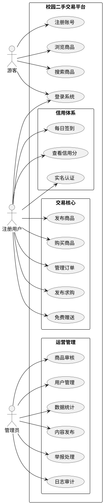

---

## 二、系统架构

### 2.1 总体架构

系统采用经典的前后端分离架构，前后端通过 HTTP RESTful API 通信，后端采用分层架构（Controller → Service → Mapper → Database），职责清晰。

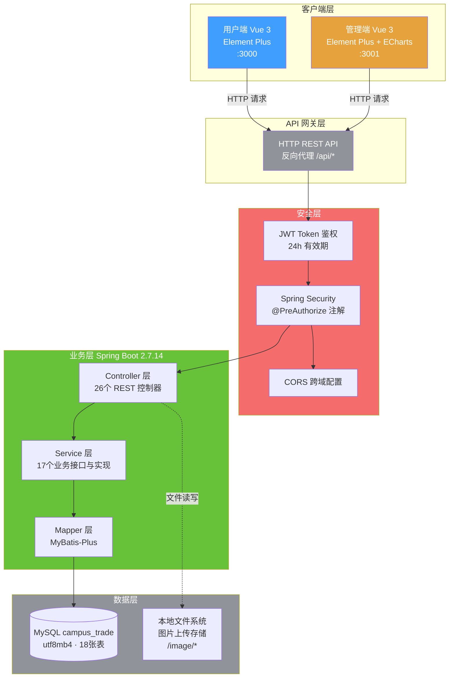

### 2.2 技术栈

#### 后端

| 技术 | 版本 | 用途 |
|------|------|------|
| Java | 17 | 运行环境（LTS 长期支持版本） |
| Spring Boot | 2.7.14 | Web 框架、IoC 容器 |
| Spring Security | 2.7.x | 认证授权、角色权限控制 |
| MyBatis-Plus | 3.5.3.1 | ORM / 增强型数据访问（逻辑删除、分页插件） |
| MySQL | 8.0+ | 关系型数据库 |
| JWT (jjwt) | 0.9.1 | 无状态 Token 鉴权 |
| Lombok | 1.18.30 | 简化实体代码（@Data、@Builder） |
| Maven | 3.6+ | 项目构建与依赖管理 |

#### 前端（用户端 & 管理端）

| 技术 | 版本 | 用途 |
|------|------|------|
| Vue | 3.3.4 | 前端响应式框架（Composition API） |
| Vite | 4.4.9 | 构建与开发服务器（热更新 HMR） |
| Vue Router | 4.2.4 | 前端路由管理（哈希模式） |
| Pinia | 2.1.6 | 状态管理（替代 Vuex，TypeScript 友好） |
| Element Plus | 2.3.14 | UI 组件库（表单、表格、弹窗、消息提示） |
| Axios | 1.5.0 | HTTP 请求封装（请求/响应拦截器） |
| ECharts | 5.4.3 | 管理端数据可视化图表（admin 专用） |
| Sass | 1.69.5 | CSS 预处理器（admin 专用） |


> **图 2：系统组件架构图**

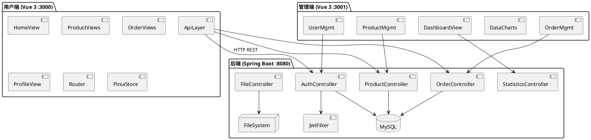

### 2.3 项目目录结构

```
91026校园二手交易平台/
├── backend/                                    # 后端 Spring Boot 项目
│   └── src/main/java/com/campus/trade/
│       ├── CampusTradeApplication.java         # Spring Boot 启动入口
│       ├── config/                             # 全局配置
│       │   ├── CorsConfig.java                 #   CORS 跨域请求配置
│       │   ├── SecurityConfig.java             #   Spring Security 安全规则配置
│       │   └── MyBatisPlusConfig.java          #   MyBatis-Plus 分页插件、逻辑删除
│       ├── controller/                         # REST API 控制器
│       │   ├── AuthController.java             #   注册、登录、Token 颁发
│       │   ├── ProductController.java          #   商品 CRUD、搜索筛选
│       │   ├── OrderController.java            #   订单全生命周期管理
│       │   ├── CommentController.java          #   商品评论与回复
│       │   ├── CategoryController.java         #   商品分类查询
│       │   ├── WantController.java             #   求购信息管理
│       │   ├── WantOfferController.java        #   求购出价管理
│       │   ├── FreeController.java             #   免费赠送管理
│       │   ├── NewsController.java             #   校园资讯
│       │   ├── NewsCategoryController.java     #   资讯分类
│       │   ├── CreditController.java           #   信用积分查询、签到
│       │   ├── AnnouncementController.java     #   平台公告
│       │   ├── BannerController.java           #   首页轮播图
│       │   ├── NotificationController.java     #   用户通知
│       │   ├── UserController.java             #   用户资料管理
│       │   ├── ReportController.java           #   用户举报
│       │   ├── CustomerServiceController.java  #   客服咨询
│       │   ├── FileController.java             #   文件上传
│       │   ├── StatisticsController.java       #   数据统计
│       │   ├── OperationLogController.java     #   操作日志
│       │   └── admin/                          #   管理端专用控制器
│       │       ├── AdminAnnouncementController.java
│       │       ├── AdminBannerController.java
│       │       ├── AdminCreditController.java
│       │       ├── AdminFreeController.java
│       │       ├── AdminReportController.java
│       │       └── AdminWantOfferController.java
│       ├── service/                            # 业务接口与实现（17 组）
│       │   ├── impl/                           #   Service 实现类
│       │   │   ├── ProductServiceImpl.java
│       │   │   ├── OrderServiceImpl.java
│       │   │   ├── CreditServiceImpl.java
│       │   │   └── ... （共 17 个实现类）
│       │   ├── IProductService.java
│       │   ├── IOrderService.java
│       │   └── ... （共 17 个接口）
│       ├── mapper/                             # MyBatis-Plus Mapper（18 个）
│       ├── entity/                             # 数据实体类（18 个）
│       ├── security/                           # JWT 安全组件
│       │   ├── JwtUtil.java                    #   Token 生成/解析/验证工具
│       │   ├── JwtAuthenticationFilter.java    #   Token 请求拦截过滤器
│       │   └── UserDetailsServiceImpl.java     #   用户认证信息加载
│       └── common/                             # 通用工具
│           └── Result.java                     #   统一 API 响应封装
│
├── UI/
│   ├── frontend/                               # 用户端 (Vue 3 · 端口 3000)
│   │   └── src/
│   │       ├── views/                          # 20 个页面组件
│   │       │   ├── Home.vue                    #   首页（分类导航+轮播+商品推荐）
│   │       │   ├── Products.vue                #   商品浏览（分类/价格/成色筛选）
│   │       │   ├── ProductDetail.vue           #   商品详情（下单/评论/推荐）
│   │       │   ├── Publish.vue                 #   发布/编辑商品
│   │       │   ├── Wants.vue                   #   求购广场
│   │       │   ├── PublishWant.vue             #   发布求购
│   │       │   ├── Free.vue                    #   免费赠送列表
│   │       │   ├── FreeDetail.vue              #   免费赠送详情
│   │       │   ├── PublishFree.vue             #   发布赠送
│   │       │   ├── Orders.vue                  #   我的订单
│   │       │   ├── Credit.vue                  #   信用中心
│   │       │   ├── CreditTest.vue              #   信用测试
│   │       │   ├── CreditDebug.vue             #   信用调试
│   │       │   ├── News.vue                    #   校园资讯
│   │       │   ├── NewsDetail.vue              #   资讯详情
│   │       │   ├── Profile.vue                 #   个人中心（10 个 tab）
│   │       │   ├── Login.vue                   #   用户登录
│   │       │   ├── Register.vue                #   用户注册
│   │       │   ├── Help.vue                    #   帮助中心
│   │       │   └── About.vue                   #   关于平台
│   │       ├── api/                            # API 接口封装
│   │       ├── router/                         # 前端路由配置
│   │       ├── stores/                         # Pinia 状态管理（用户/应用状态）
│   │       └── utils/                          # 工具函数（含 request.js 拦截器）
│   │
│   └── admin/                                  # 管理端 (Vue 3 · 端口 3001)
│       └── src/views/                          # 18 个管理页面
│           ├── Login.vue                       #   管理员登录（角色校验）
│           ├── Dashboard.vue                   #   数据仪表盘（核心指标）
│           ├── DataCharts.vue                  #   ECharts 可视化图表
│           ├── Users.vue                       #   用户管理
│           ├── Products.vue                    #   商品管理
│           ├── Orders.vue                      #   订单管理
│           ├── Categories.vue                  #   分类管理
│           ├── Comments.vue                    #   评论管理
│           ├── Wants.vue                       #   求购管理
│           ├── WantOffers.vue                  #   出价管理
│           ├── Free.vue                        #   免费赠送管理
│           ├── News.vue                        #   资讯管理
│           ├── NewsCategories.vue              #   资讯分类管理
│           ├── Credits.vue                     #   信用管理
│           ├── Reports.vue                     #   举报管理
│           ├── Banners.vue                     #   轮播图管理
│           ├── Announcements.vue               #   公告管理
│           ├── CustomerService.vue             #   客服咨询
│           └── Logs.vue                        #   操作日志审计
│
├── docs/                                       # 项目文档
│   └── 项目总结报告.md
│
└── tools/                                      # 辅助脚本
    ├── add_contributor_comments.py             #   自动添加贡献注释
    └── contributor_labels.json                 #   贡献者标签配置
```

### 2.4 请求处理流程

以下序列图展示了一次完整 API 请求的处理链路：

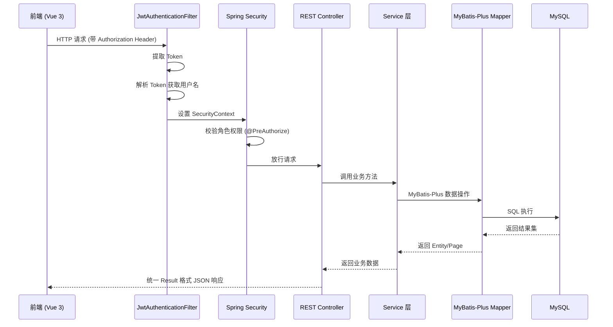

---

## 三、功能模块详解

### 3.1 用户端功能

用户端共 20 个页面，覆盖校园二手交易全场景。

#### 3.1.1 首页

**页面**：`Home.vue`  
**后端接口**：轮播图 `/api/banners/active`、公告 `/api/announcements/active`、商品列表 `/api/products`

首页采用三栏布局，是平台的信息聚合与服务入口：

- **左侧垂直分类导航** — 从后端动态获取 9 个商品分类（电子产品、图书教材、生活用品、运动户外等），每项配 SVG 图标，点击跳转至商品列表页自动筛选
- **中部核心区** — 轮播横幅（从 Banner 表动态获取，支持多图切换与自动轮播）+ 搜索栏（关键词模糊搜 + 热门搜索标签快速命中）+ 最新商品推荐（5 列网格布局，支持分类 tab 过滤与分页加载）
- **右侧信息面板** — 登录状态显示用户信用分、认证状态、快捷发布入口；未登录显示注册/登录推广横幅 + 平台公告栏（最多 5 条，支持 "HOT" 热门 / "NEW" 最新类型标签）
- **悬浮客服按钮** — 右下角固定悬浮，点击跳转客服咨询

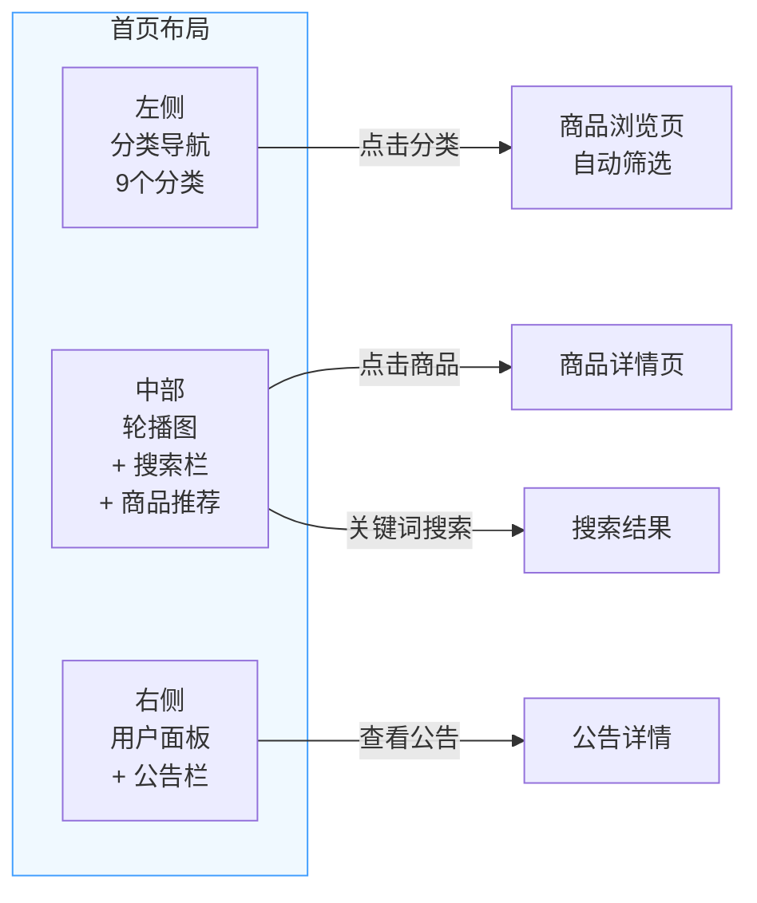

#### 3.1.2 商品浏览与搜索

**页面**：`Products.vue`  
**后端接口**：`GET /api/products`（分页、多条件筛选、排序）

商品列表页采用左侧筛选 + 右侧网格的经典电商布局：

- **多维筛选** — 分类树（支持切换分类）、价格区间（最低价/最高价输入框）、成色筛选（全新 / 几乎全新 / 良好 / 可接受四档单选）
- **排序方式** — 综合排序（默认）、最新发布、价格升序、价格降序
- **商品卡片** — 展示缩略图、商品标题、当前价格、卖家头像与昵称、所在地，hover 效果
- **状态处理** — 加载骨架屏过渡、空数据占位提示、底部分页器
- **URL 参数穿透** — 支持 `?categoryId=xxx&keyword=xxx` 直接定位到特定筛选条件

#### 3.1.3 商品详情

**页面**：`ProductDetail.vue`  
**后端接口**：`GET /api/products/{id}`、`POST /api/orders`

商品详情页是交易流程的核心入口，分以下区域：

- **图片区** — 主图预览（点击可放大查看原图）+ 底部缩略图切换
- **信息区** — 商品标题、浏览量/发布时间信息、价格展示（现价与划线原价对比）、属性标签（成色、交易位置、库存量、所属分类）
- **卖家信息卡** — 卖家头像、昵称、实名认证标记、信用等级与分数（按分数区间显色）
- **购买操作** — 数量选择器 + "立即购买"按钮 + 收藏按钮
- **内容 tab** — 商品详情（描述文本、成色说明）、留言提问（楼层式评论回复，分页加载）
- **推荐商品** — 同分类 Top 4 推荐卡片
- **举报入口** — 弹窗表单提交违规举报

#### 3.1.4 发布商品

**页面**：`Publish.vue`  
**后端接口**：`POST /api/products`、`PUT /api/products/{id}`

支持新增和编辑两种模式（通过查询参数 `?id=` 区分）：

- **图片上传** — 最多 5 张图片，第一张自动设为封面图，支持预览和删除
- **商品信息** — 标题、详细描述（多行文本框）
- **价格与属性** — 定价、原价（含划线价对比）、成色四档单选、库存数量
- **分类与位置** — 分类下拉选择、交易地点输入
- **表单校验** — 标题、分类、价格、描述、位置为必填项


> **图 3：发布商品活动图**

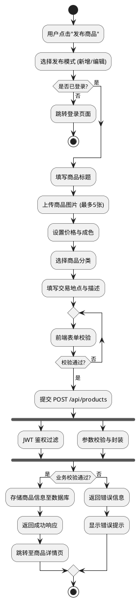

#### 3.1.5 求购广场

**页面**：`Wants.vue`、`PublishWant.vue`  
**后端接口**：`GET /api/wants`、`POST /api/wants`、`POST /api/want-offers`

求购模块连接有购买需求的学生与潜在卖家：

- **浏览** — 卡片列表展示求购信息（发布者头像、标题、标签云、预算范围），关键词搜索、按预算排序
- **出价** — 点击"我以此价出"，弹出出价表单（填写出价金额、商品描述、联系方式、交易地点），系统校验出价是否在预算范围内
- **发布求购** — 标题 + 详细描述（10-500 字）+ 预算范围（最低/最高价）+ 自定义标签（最多 5 个标签，Enter 添加）

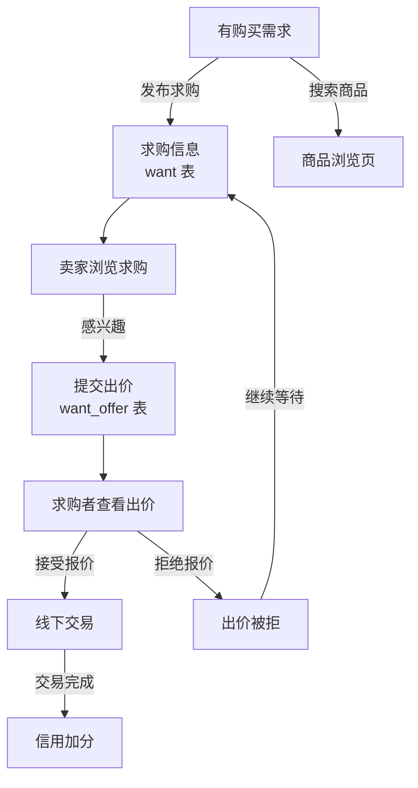

#### 3.1.6 免费赠送

**页面**：`Free.vue`、`FreeDetail.vue`、`PublishFree.vue`  
**后端接口**：`GET /api/free`、`POST /api/free`、`PUT /api/free/{id}`

绿色主题的免费赠送模块，践行校园资源循环利用理念：

- **列表** — 4 列网格展示，每张卡片带"免费送"绿色角标、"¥0.00 仅需付邮"提示
- **详情** — 完整物品信息展示，"完全免费，自取或邮费自付"温馨提示
- **发布** — 标题 + 图片（最多 6 张）+ 描述 + 成色选择 + 交接地点
- **状态管理** — 发布者可编辑信息、标记已送出、重新上架

#### 3.1.7 订单管理

**页面**：`Orders.vue`（精简版）、`Profile.vue`（完整版）  
**后端接口**：`GET /api/orders/buyer`、`GET /api/orders/seller`、`PUT /api/orders/{id}/pay` 等

订单模块覆盖交易全生命周期，支持买家/卖家双视角切换：

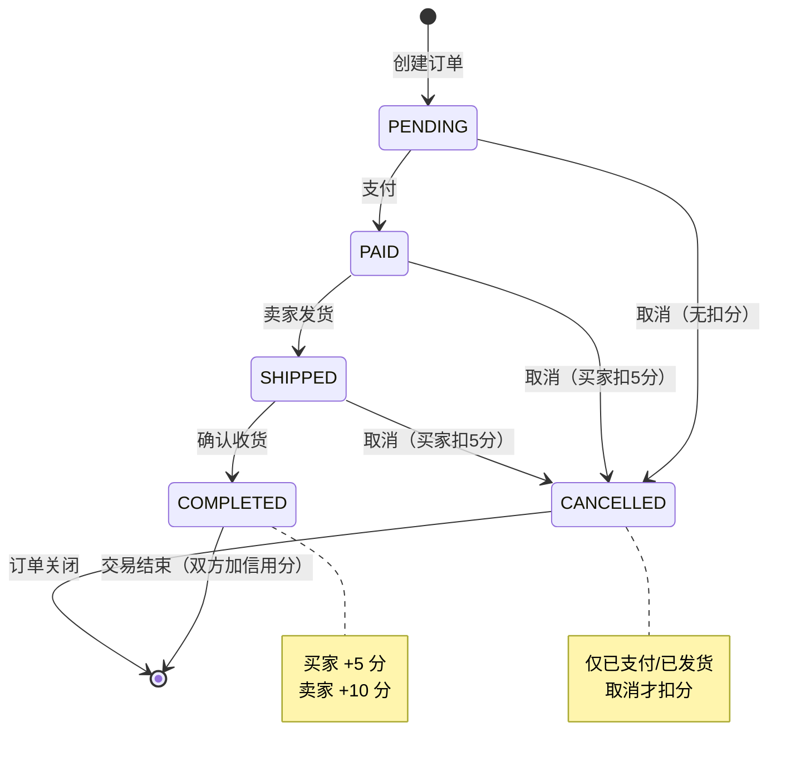

- **订单号格式**：`ORD` + `yyyyMMddHHmmss`（时间戳）+ 4 位随机数（如 `ORD202312032105301234`）
- **买家视角** — 支付（模拟支付宝/微信/余额）、确认收货、取消订单
- **卖家视角** — 发货操作、查看订单详情
- **信用联动** — 交易完成后自动为买卖双方加分；违规取消订单扣除买家信用分


> **图 4：完整交易流程时序图**

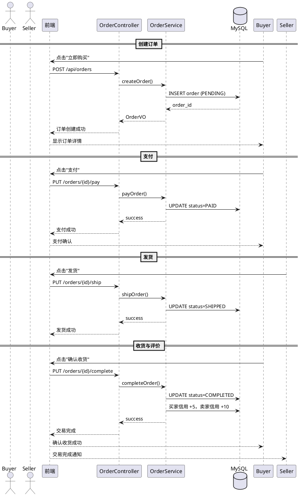

#### 3.1.8 信用中心

**页面**：`Credit.vue`  
**后端接口**：`GET /api/credit/my`、`POST /api/credit/daily-checkin`、`GET /api/credit/rules`

完善的用户信用评价体系，覆盖积分获取、等级权益、行为记录全链路：

**信用分等级划分**：

| 等级 | 英文标识 | 分数区间 | 图标 | 权益 |
|------|----------|----------|------|------|
| 优秀 | EXCELLENT | ≥150 分 | 🏆 | 极速发布、优先展示、担保交易、专属徽章 |
| 良好 | GOOD | 100-149 分 | ⭐ | 优先展示、担保交易 |
| 一般 | NORMAL | 60-99 分 | 📋 | 基础交易功能 |
| 较差 | BAD | <60 分 | ⚠️ | 交易受限 |

**信用分获取与扣除规则**：

| 行为 | 分值 | 类型 | 触发场景 |
|------|------|------|----------|
| 每日首次登录 | +2 | 任务 | 登录自动触发 |
| 每日签到 | +2 | 任务 | 用户手动签到 |
| 发布商品 | +5 | 任务 | 商品审核通过 |
| 商品首次获得评价（卖家） | +10 | 评价 | 收到第一条评论 |
| 交易完成（买家） | +5 | 交易 | 订单确认完成 |
| 交易完成（卖家） | +10 | 交易 | 订单确认完成 |
| 实名认证 | +20 | 任务 | 认证通过 |
| 完善个人信息 | +10 | 任务 | 补全资料提交 |
| 违规取消订单（买家） | -5 | 违规 | 取消已支付/已发货订单 |

**页面功能**：
- **信用概览** — 圆形大数字展示信用分 + 等级名称和图标
- **每日签到** — 签到按钮 + 连续签到展示，培养用户粘性
- **信用权益** — 4 个卡片展示各等级专属权益
- **信用规则** — 从后端动态获取，加分/扣分行为表格
- **信用记录** — 分页表格展示每条变更明细（原因、变化值、变化前后数值、时间）

#### 3.1.9 校园资讯

**页面**：`News.vue`、`NewsDetail.vue`  
**后端接口**：`GET /api/news`、`GET /api/news/{id}`

资讯内容模块，支持平台运营方发布校园相关信息：

- **列表页** — 水平分类筛选胶囊（从资讯分类动态获取）+ 双栏布局（左侧图文资讯列表 + 右侧热门排行榜）
- **详情页** — 完整文章正文展示 + 分类标签 + 作者信息 + 发布日期 + 阅读量 + 封面图
- **热门排行** — 按浏览量排序的前 5 条资讯

#### 3.1.10 个人中心

**页面**：`Profile.vue`  
**后端接口**：多端点组合

个人中心是功能最丰富的页面，包含 10 个功能 tab：

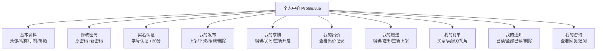

#### 3.1.11 用户认证

**页面**：`Login.vue`、`Register.vue`  
**后端接口**：`POST /api/auth/login`、`POST /api/auth/register`

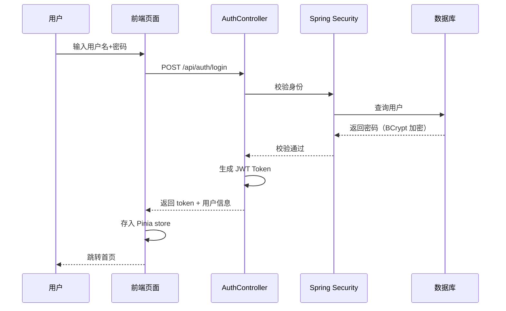

- **注册** — 头像上传 + 用户名（3-20 字符，字母/数字/下划线）+ 昵称 + 手机号（11 位校验）+ 校园邮箱（格式校验）+ 密码（6 位以上）+ 确认密码一致性校验
- **登录** — 用户名 + 密码，支持"记住我"（localStorage 存储）、密码显隐切换、回车键提交
- **安全机制** — 密码 BCrypt 加密存储，JWT Token 签名验证（HS512 算法），24 小时有效期

---

### 3.2 管理端功能

管理端共 18 个管理页面（不含登录），覆盖平台运营全场景。所有页面采用一致的设计模式：搜索筛选栏 + 数据表格 + 弹窗表单/详情。

#### 3.2.1 数据仪表盘

**页面**：`Dashboard.vue`  
**后端接口**：`GET /api/statistics/overview`、`GET /api/statistics/dashboard`

首页数据总览，每 30 秒自动轮询刷新：

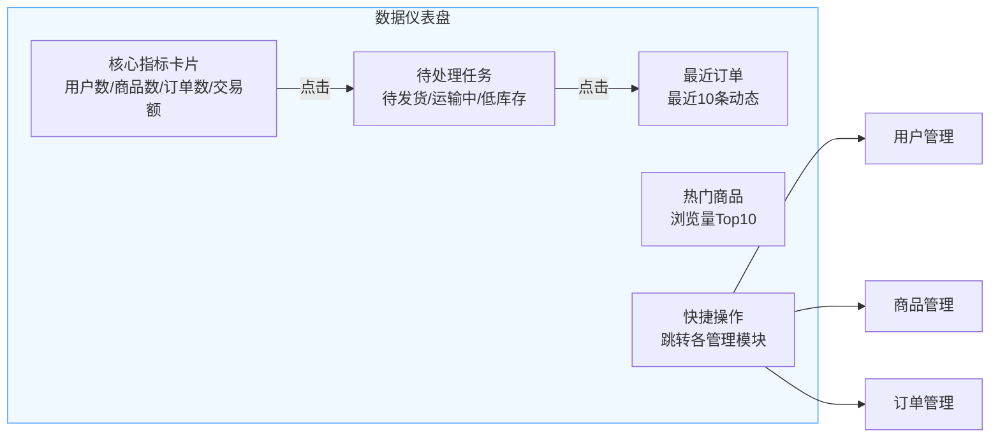

#### 3.2.2 数据图表

**页面**：`DataCharts.vue`  
**后端接口**：`GET /api/statistics/charts/*`

基于 ECharts 的 4 类运营数据图表，支持 7天/15天/30天时间范围切换：

- **交易趋势图** — 双 Y 轴折线图（左侧轴=订单数量，右侧轴=交易金额），X 轴展示日期
- **商品分类分布** — 环形饼图，各分类商品数量与占比
- **热门商品排行** — 水平条形图，按浏览量降序排列 Top 10
- **用户增长趋势** — 面积图叠加折线图展示

#### 3.2.3 用户管理

**页面**：`Users.vue`  
**后端接口**：`GET/POST/PUT/DELETE /api/users`

- 分页列表，按关键词（用户名/邮箱/手机号）、角色（USER/ADMIN）、状态搜索
- CRUD：新增用户、编辑资料、启用/禁用（状态切换）、删除
- 校验规则：用户名 3-20 字符（字母/数字/下划线），密码 6-20 字符，邮箱格式，手机号正则

#### 3.2.4 商品管理

**页面**：`Products.vue`  
**后端接口**：`GET/POST/PUT/DELETE /api/products`、`PUT /api/products/{id}/status`

- 分页列表，按名称、分类、状态（ON_SALE / SOLD / OFF_SALE）筛选
- 完整 CRUD + 上架/下架状态切换 + 图片回显预览

#### 3.2.5 订单管理

**页面**：`Orders.vue`  
**后端接口**：`GET/PUT/DELETE /api/orders`、`PUT /api/orders/{id}/{action}`

- 按订单号、状态搜索
- 订单详情查看（含各状态时间戳、买卖双方信息、收货地址）
- 订单操作：发货、完成、取消（仅 PENDING 可取消）
- 删除：仅 COMPLETED 或 CANCELLED 可删除

#### 3.2.6 分类管理

**页面**：`Categories.vue`  
**后端接口**：`GET/POST/PUT/DELETE /api/categories`

- 全量分类列表，支持名称搜索
- CRUD + 启用/禁用状态切换 + 排序值调整

#### 3.2.7 评论管理

**页面**：`Comments.vue`  
**后端接口**：`GET /api/comments/admin/all`、`DELETE /api/comments/admin/{id}`

- 按评论内容搜索
- 管理员强制删除违规评论

#### 3.2.8 求购与出价管理

**页面**：`Wants.vue`、`WantOffers.vue`  
**后端接口**：`GET/DELETE /api/wants`、`GET/DELETE /api/admin/want-offers`

- 求购列表按状态（ACTIVE/CLOSED）筛选，含查看详情和删除
- 出价列表按出价状态（PENDING/ACCEPTED/REJECTED）筛选

#### 3.2.9 免费赠送管理

**页面**：`Free.vue`（管理端）  
**后端接口**：`GET/DELETE /api/admin/free`

- 按关键词、状态（AVAILABLE/COMPLETED/CLOSED）筛选
- 详情查看（含多图预览）、删除

#### 3.2.10 资讯管理

**页面**：`News.vue`（管理端）、`NewsCategories.vue`  
**后端接口**：`GET/POST/PUT/DELETE /api/news`、`GET/POST/PUT/DELETE /api/news-categories`

- 资讯 CRUD（封面图、分类、正文、发布/草稿状态）
- 资讯分类 CRUD（名称校验 2-20 字符）+ 启用/禁用

#### 3.2.11 信用管理

**页面**：`Credits.vue`  
**后端接口**：`GET/POST /api/admin/credits`

- 用户信用分列表（含等级彩色徽章、信用统计）
- 信用记录查询（变更明细）
- **管理员调分**：手动增加或扣除信用分（含类型选择、分值 1-100、原因说明，自动添加"[管理员调整]"前缀）
- 重置实名认证（允许用户重新认证 +20 分）
- 重置信用分（恢复 100 初始值，清空统计）

#### 3.2.12 举报管理

**页面**：`Reports.vue`  
**后端接口**：`GET/POST /api/admin/reports`

处理流程如下：

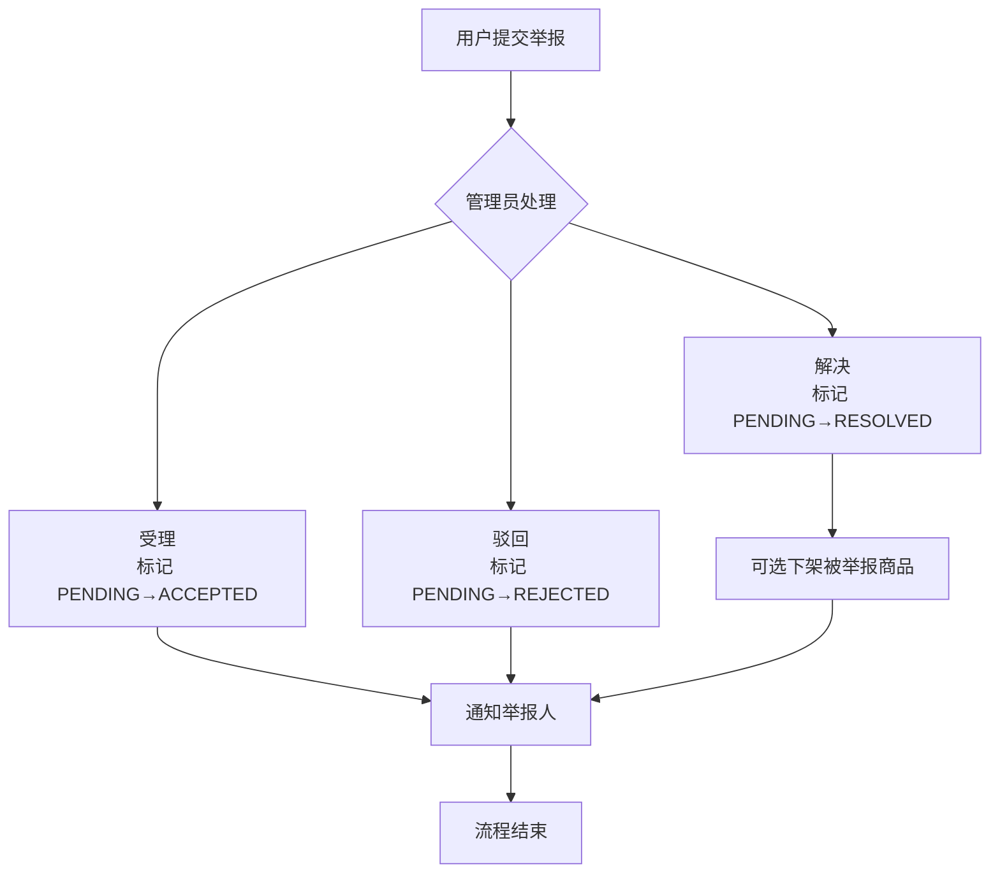

#### 3.2.13 运营内容管理（轮播图 / 公告）

**页面**：`Banners.vue`、`Announcements.vue`  
**后端接口**：`GET/POST/PUT /api/admin/banners`、`GET/POST/PUT /api/admin/announcements`

- **轮播图** — 图片 URL、标题、副标题、跳转链接、排序值、状态、有效期起止时间
- **公告** — 标题、内容（最多 1000 字）、类型（HOT / NEW / NORMAL 彩色标签）、优先级、状态、有效期
- 均支持启用/停用切换、排序调整

#### 3.2.14 客服咨询管理

**页面**：`CustomerService.vue`  
**后端接口**：`GET/PUT/DELETE /api/customer-service/admin/*`

- 统计展示：待处理 / 处理中 / 已回复 / 已关闭 卡片计数
- 按状态、类型（GENERAL / COMPLAINT / SUGGESTION / TECHNICAL）、关键词筛选
- 管理操作：回复咨询、标记处理中、关闭咨询、删除

#### 3.2.15 操作日志审计

**页面**：`Logs.vue`  
**后端接口**：`GET/DELETE /api/logs`

- 多维度搜索：操作类型（CREATE/UPDATE/DELETE/QUERY/LOGIN）、操作模块（USER/PRODUCT/ORDER 等 10 余种）、管理员名称、关键词
- 日志详情：IP 地址、浏览器、操作系统信息
- 清理策略：清理 7 天前 / 30 天前 / 清空全部（含二次确认）

---

## 四、数据库设计

数据库名：`campus_trade`，字符集 `utf8mb4`，共 **18 张表**：

### 4.1 数据表总览

| 表名 | 说明 | 关键字段 | 所属模块 |
|------|------|----------|----------|
| `user` | 用户表 | 角色（USER/SELLER/ADMIN）、学号、认证状态 | 认证、用户管理 |
| `category` | 商品分类 | 名称、排序值、启用状态 | 分类管理 |
| `product` | 商品表 | 成色、库存、浏览量、图片（JSON）、状态（ON_SALE/SOLD/OFF_SALE） | 商品模块 |
| `order` | 订单表 | 状态机（5 种状态）、金额、地址、各状态时间戳 | 订单模块 |
| `comment` | 评论表 | 楼层式回复，关联用户与商品 | 评论模块 |
| `want` | 求购表 | 预算范围、自定义标签（JSON 数组） | 求购模块 |
| `want_offer` | 求购出价表 | 出价金额、联系方式、状态（PENDING/ACCEPTED/REJECTED） | 出价模块 |
| `free` | 免费赠送表 | 成色、交接地点、状态（AVAILABLE/COMPLETED/CLOSED） | 赠送模块 |
| `news` | 资讯表 | 分类外键、封面图、浏览量、发布状态 | 资讯模块 |
| `news_category` | 资讯分类 | 名称、排序值、启用状态 | 资讯分类管理 |
| `banner` | 轮播图表 | 图片 URL、标题、排序、有效期 | 轮播图管理 |
| `announcement` | 公告表 | 类型（HOT/NEW/NORMAL）、优先级、有效期 | 公告管理 |
| `notification` | 通知表 | 类型、内容、已读状态、关联业务 ID | 通知系统 |
| `user_credit` | 用户信用表 | 积分、等级、获得/扣除统计、签到日期 | 信用体系 |
| `credit_record` | 信用变更记录 | 变化分值（正/负）、变化前后数值、类型、原因 | 信用记录 |
| `report` | 举报表 | 原因、状态、处理人、处理结果、可联动下架商品 | 举报管理 |
| `customer_service` | 客服咨询表 | 类型（GENERAL/COMPLAINT/SUGGESTION/TECHNICAL）、状态、回复内容 | 客服模块 |
| `operation_log` | 操作日志表 | 管理员 ID、操作类型、模块、请求 IP、浏览器 UA | 审计日志 |


> **图 5：核心领域模型类图**

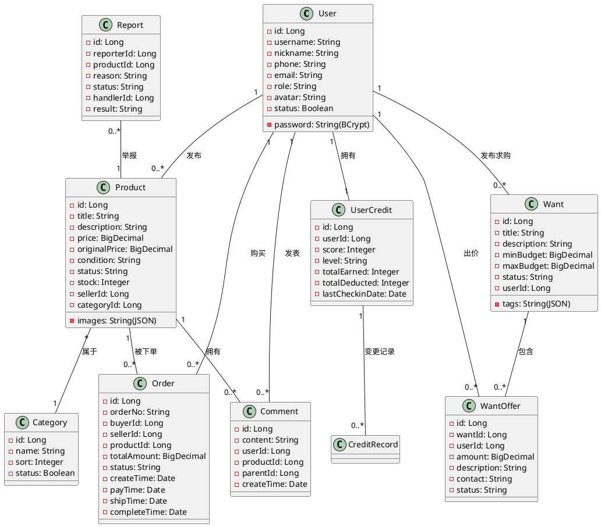

### 4.2 核心实体关系

```mermaid
erDiagram
    USER ||--o{ PRODUCT : "发布（seller_id）"
    USER ||--o{ ORDER : "购买（buyer_id）"
    USER ||--o{ ORDER : "出售（seller_id）"
    USER ||--o{ COMMENT : "发表评论"
    USER ||--o{ WANT : "发布求购"
    USER ||--o{ WANT_OFFER : "提交出价"
    USER ||--o{ FREE : "发布赠送"
    USER ||--o{ NOTIFICATION : "接收通知"
    USER ||--o{ REPORT : "提交举报"
    USER ||--o{ CUSTOMER_SERVICE : "咨询客服"

    PRODUCT ||--o{ COMMENT : "拥有评论"
    PRODUCT ||--o{ ORDER : "被下单"
    PRODUCT }o--|| CATEGORY : "属于分类"

    USER ||--|| USER_CREDIT : "拥有信用档案"
    USER_CREDIT ||--o{ CREDIT_RECORD : "产生变更记录"

    WANT ||--o{ WANT_OFFER : "收到出价"

    NEWS }o--|| NEWS_CATEGORY : "属于分类"

    REPORT o--|| PRODUCT : "关联被举报商品"
    OPERATION_LOG ||--o| USER : "由管理员产生"
```

### 4.3 关键设计说明

- **逻辑删除** — 所有业务表通过 MyBatis-Plus `@TableLogic` 注解实现逻辑删除，保障数据可追溯
- **JSON 字段** — `product.images` 和 `want.tags` 使用 MySQL JSON 类型，MyBatis-Plus `JacksonTypeHandler` 自动序列化/反序列化
- **时间戳审计** — 每张表均包含 `create_time` 和 `update_time` 字段，由 MyBatis-Plus 自动填充
- **订单状态机** — status 字段维护 5 种状态及其合法流转路径，业务层控制状态变更逻辑

---

## 五、安全与鉴权

### 5.1 认证流程

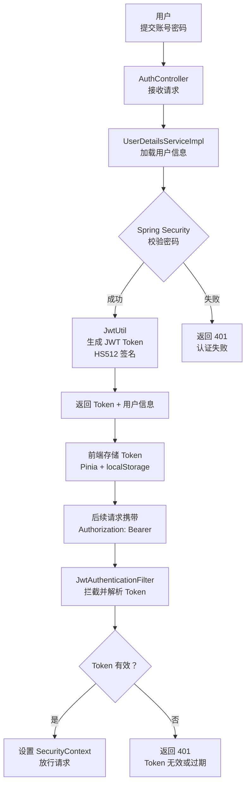

### 5.2 权限控制矩阵

| 角色 | 用户端浏览 | 发布/交易 | 管理端访问 | 敏感操作 |
|------|-----------|-----------|-----------|---------|
| **USER**（普通用户） | ✅ | ✅ | ❌ | ❌ |
| **SELLER**（卖家） | ✅ | ✅（含商品管理） | ❌ | ❌ |
| **ADMIN**（管理员） | ✅ | ✅ | ✅ | ✅ |

- 安全配置类 `SecurityConfig.java` 配置 URL 权限规则：公共接口（`/auth/**`、`/products/**`、`/categories/**`、`/news/**`、`/files/**`）无需认证，其余接口需登录
- 管理端敏感接口使用 `@PreAuthorize("hasRole('ADMIN')")` 二次校验
- 管理员登录时前端额外校验 role 是否为 `ADMIN`，非管理员拒绝访问

### 5.3 安全措施总结

| 措施 | 实现方式 |
|------|----------|
| 密码加密 | BCrypt 加密存储，不可逆 |
| Token 鉴权 | JWT HS512 签名，24 小时有效，无状态 |
| 跨域防护 | CORS 配置白名单 |
| 文件上传安全 | 10MB 大小限制，UUID 重命名防冲突 |
| 逻辑删除 | MyBatis-Plus `@TableLogic`，数据不物理删除 |
| 操作审计 | 所有管理操作记录 IP、操作人、时间、模块 |
| 前端守卫 | Vue Router `meta.requiresAuth` 路由守卫 |
| 双重校验 | 前端路由守卫 + 后端 `@PreAuthorize` |

---

## 六、部署与运行

### 6.1 环境要求

| 组件 | 版本要求 | 用途 |
|------|----------|------|
| JDK | 17+ | Java 运行环境 |
| Maven | 3.6+ | 后端项目构建 |
| MySQL | 8.0+ | 数据库 |
| Node.js | 16+ | 前端项目构建与运行 |

### 6.2 快速启动

```bash
# 1. 创建数据库并初始化表结构 + 测试数据
mysql -u root -p campus_trade < backend/src/main/resources/sql/campus_trade.sql

# 2. 修改数据库连接配置
#    编辑 backend/src/main/resources/application.yml，设置数据库用户名和密码

# 3. 启动后端服务（backend 目录）
mvn spring-boot:run

# 4. 启动用户端（UI/frontend 目录）
npm install && npm run dev

# 5. 启动管理端（UI/admin 目录）
npm install && npm run dev
```

### 6.3 访问地址

| 服务 | 地址 | 说明 |
|------|------|------|
| 后端 API | http://localhost:8080/api | RESTful 接口 |
| 用户端 | http://localhost:3000 | 学生用户访问 |
| 管理端 | http://localhost:3001 | 管理员运营后台 |

### 6.4 测试账号

| 角色 | 用户名 | 密码 | 说明 |
|------|--------|------|------|
| 管理员 | admin | 123456 | 可访问管理端全部功能 |
| 普通用户 | user1 | 123456 | 可浏览、发布、交易 |
| 卖家 | seller1 | 123456 | 可发布商品、管理订单 |


> **图 6：系统部署拓扑图**

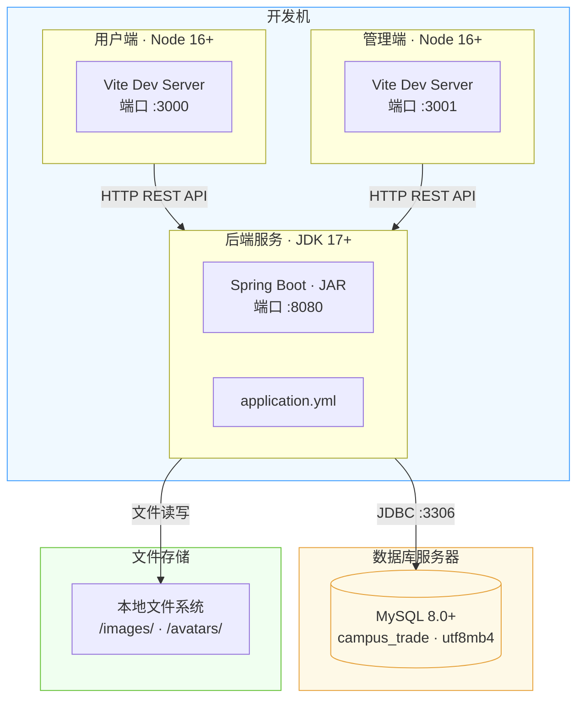

---

## 七、团队分工与代码贡献

项目代码按函数粒度统计，团队总贡献 **3000 行**：

| 成员 | 贡献行数 | 占比 | 主要贡献模块 |
|------|----------|------|-------------|
| hangu | 1500 行 | 50% | 前端页面开发（用户端 + 管理端页面组件） |
| kelei | 1500 行 | 50% | 后端服务开发（Controller + Service + Mapper + Entity） |

各源文件顶部均标注了文件级贡献统计，Vue/JS 文件在函数上方标注 `@contributor` 注释，便于追溯模块负责人。

---

## 八、项目亮点

1. **功能完整闭环** — 覆盖商品交易、求购匹配、免费赠送、信用评价、资讯公告、客服咨询等校园二手全场景，用户无需离开平台即可完成全部交易流程

2. **双端分离架构** — 用户端与管理端独立部署，职责清晰。用户端注重简洁易用的购物体验，管理端注重数据驱动的运营决策

3. **信用激励体系** — 积分任务（签到、发布、认证）+ 交易评价 + 管理干预的三层信用机制，有效提升平台交易信任度和用户粘性。信用分与等级、权益挂钩，形成正向激励循环

4. **数据可视化运营** — 管理端集成 ECharts 4 类图表（趋势、分布、排行、增长），支持 7/15/30 天时间切换，辅助运营决策

5. **安全可控** — 从密码加密（BCrypt）、Token 鉴权（JWT）、角色权限控制（RBAC）、操作日志审计（IP+UA+时间）到举报处理机制，形成完整的安全链路

6. **可扩展架构** — 标准 Controller → Service → Mapper 分层设计，MyBatis-Plus 简化 CRUD 操作，Vite HMR 提升开发体验，易于功能扩展和维护

7. **可追溯审计** — 管理员所有操作（增/删/改/查/登录）均记录到 `operation_log` 表，含请求 IP、浏览器信息、操作时间，满足平台运营审计需求

---

## 九、存在问题与改进方向

| 类别 | 现状 | 改进建议 | 优先级 |
|------|------|----------|--------|
| 支付 | 线下交易为主，线上仅有模拟支付入口 | 接入校园一卡通或微信/支付宝第三方支付 | 🔴 高 |
| 消息 | 站内通知（轮询拉取） | 增加 WebSocket 实时消息推送，支持即时聊天 | 🔴 高 |
| 搜索 | 关键词 LIKE + 分类筛选 | 引入 Elasticsearch 全文检索，支持分词、同义词、商品推荐 | 🟡 中 |
| 部署 | 本地开发配置，手动启动 | Docker Compose 一键部署，增加 CI/CD 自动化发布流程 | 🟡 中 |
| 测试 | 缺少自动化测试 | 补充 JUnit 单元测试 + MockMvc 接口测试 + 前端 E2E 测试 | 🟡 中 |
| 移动端 | 仅 Web 响应式布局 | 开发微信小程序或 UniApp 跨端应用 | 🟢 低 |
| 图片存储 | 本地文件系统 | 接入阿里云 OSS / 七牛云对象存储，支持 CDN 加速 | 🟢 低 |
| 数据备份 | 无自动备份策略 | 配置 MySQL 定时备份 + 异地容灾 | 🟢 低 |


> **图 7：订单交易对象实例图**

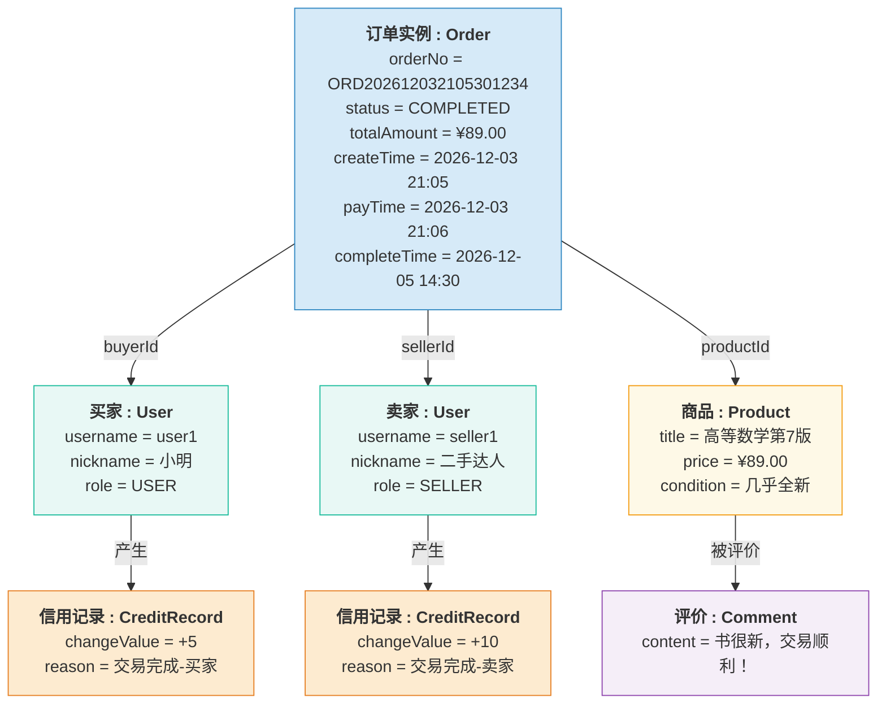

---

## 十、总结

本项目成功实现了一个功能较为完整的**校园二手交易平台**，采用 Spring Boot + Vue 3 前后端分离架构，具备商品交易、求购匹配、免费赠送、信用评价、内容运营和后台管理等核心能力。

系统结构清晰、模块划分合理，代码贡献按文件粒度标注，便于团队协作与责任追溯。**18 张数据表**覆盖全部业务实体，**26 个 REST 控制器**提供完整的 API 服务，**20 个用户端页面 + 18 个管理端页面**构成完整的双端交互界面。

项目适合作为高校开源与群智课程的综合实践项目，也具备进一步产品化扩展的基础。后续可在实时消息、在线支付、移动端适配、自动化测试等方面持续迭代完善。

---

*报告生成于 campus-second-hand-trade 项目仓库 · docs/项目总结报告.md · v2.0*
